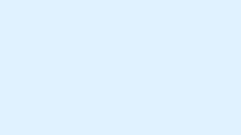

# bunny.net marketing animations

A [Remotion](https://www.remotion.dev) project of short (≈7s) animated sequences used in
bunny.net marketing videos. Each sequence is a self-contained composition, bucketed by the
**campaign** it belongs to, and rendered at 3K for compositing.

## Structure

Scenes are grouped by campaign so the project scales as we add more videos. Shared design
primitives (theme, helpers, transitions) live in one place; campaign folders only contain the
scenes themselves.

```
src/
  Root.tsx                  # the registry — every composition, lazy-loaded & grouped by campaign
  index.ts / index.css      # Remotion entry + global styles
  shared/                   # cross-campaign primitives (imported as "@/shared/...")
    theme.ts                #   colours (brand/red/ink + rgba helpers), fonts, dimensions, layout
    util.ts                 #   deterministic rng, request-path maths, threat data
    SceneTransition.tsx     #   eased fade in/out wrapper every scene sits inside
    brand.tsx               #   <BunnyLogo variant> + <ShieldMascot> (single-source asset names)
    BrandBumper.tsx         #   <BrandBumper> reusable hero+title card (navy/green/light themes)
    Glow.tsx                #   <Glow> soft radial brand glow ("bubble of light")
    ImpactRing.tsx          #   <ImpactRing> expanding/fading ring on rejection or impact
    BadTraffic.tsx          #   makeBads() + <BadDot> — red request flies in, bounces off a gate
    features.ts             #   Shield feature names + ids
    FeatureIcon.tsx         #   renders official feature icons
  campaigns/
    shield-protection/      # Shield Protection campaign
      BunnyShield/  LegacyStack/  UnifiedEdge/  Fingerprint/
      Pillars/  Stats/  Frictionless/  Bumper/  AILearning/
    brand/                  # reusable bunny.net title cards
      TitleBumper/
    cli/                    # CLI campaign
      EdgeScriptsDeploy/
```

### Imports use the `@/` alias

To keep imports stable when files move between folders, cross-folder imports use the `@/`
alias (→ `src/`) instead of brittle `../../..` paths:

```ts
import { COLORS, FONT } from "@/shared/theme";
import { SceneTransition } from "@/shared/SceneTransition";
```

The alias is declared in two places (keep them in sync):
- [`tsconfig.json`](./tsconfig.json) → `compilerOptions.paths` (for `tsc` and the editor)
- [`remotion.config.ts`](./remotion.config.ts) → webpack `resolve.alias` (for the bundler)

### Lazy loading — we don't load every scene at once

[`Root.tsx`](./src/Root.tsx) registers each composition with `lazyComponent` (a dynamic
`import()`), so a scene's code is only fetched when its composition is opened in the Studio or
rendered. Compositions are wrapped in Remotion `<Folder>`s (`Shield-Protection`, `CLI`) so they
appear bucketed by campaign in the Studio sidebar. Durations are kept as registration metadata
in `Root.tsx` so the heavy scene modules stay out of the initial bundle.

## Scenes

All scenes are 1920×1080 @ 30fps, 7s (210 frames) unless noted. Render at 3K with `--scale=1.5`.

### Shield Protection

| Composition | Length | Preview |
| --- | --- | --- |
| [`BunnyShield`](./src/campaigns/shield-protection/BunnyShield/BunnyShield.tsx) | 7s |  |
| [`LegacyStack`](./src/campaigns/shield-protection/LegacyStack/LegacyStack.tsx) | 7s |  |
| [`UnifiedEdge`](./src/campaigns/shield-protection/UnifiedEdge/UnifiedEdge.tsx) | 7s |  |
| [`Fingerprint`](./src/campaigns/shield-protection/Fingerprint/Fingerprint.tsx) | 7s |  |
| [`OneLayer`](./src/campaigns/shield-protection/Pillars/OneLayer.tsx) | 7s |  |
| [`EuropeanTrust`](./src/campaigns/shield-protection/Pillars/EuropeanTrust.tsx) | 7s |  |
| [`Stats`](./src/campaigns/shield-protection/Stats/Stats.tsx) | 7s |  |
| [`Frictionless`](./src/campaigns/shield-protection/Frictionless/Frictionless.tsx) | 7s |  |
| [`Bumper`](./src/campaigns/shield-protection/Bumper/Bumper.tsx) | 7s |  |
| [`AILearning`](./src/campaigns/shield-protection/AILearning/AILearning.tsx) | 7s |  |

### Brand

Reusable title cards built on the shared `<BrandBumper>`. Swap the hero for any product
mascot/logo and pick a theme (`navy` / `green` / `light`).

| Composition | Length | Preview |
| --- | --- | --- |
| [`BunnyBumper`](./src/campaigns/brand/TitleBumper/TitleBumper.tsx) | 7s |  |
| [`BunnyBumperGreen`](./src/campaigns/brand/TitleBumper/TitleBumper.tsx) | 7s |  |
| [`BunnyBumperGreenWhite`](./src/campaigns/brand/TitleBumper/TitleBumper.tsx) | 7s |  |

### CLI

| Composition | Length | Preview |
| --- | --- | --- |
| [`EdgeScriptsDeploy`](./src/campaigns/cli/EdgeScriptsDeploy/EdgeScriptsDeploy.tsx) | 9s |  |

## Commands

```console
npm i                 # install
npm run dev           # open Remotion Studio (preview / scrub)
npm run lint          # eslint + tsc

# rebuild the README preview GIFs (assets/previews/<id>.gif)
npm run previews              # all compositions
npm run previews -- Bumper    # only the listed composition id(s)

# render a single composition at 3K (2880×1620)
npx remotion render <CompositionId> out/<name>-3k.mp4 --scale=1.5

# grab a still for quick checks
npx remotion still <CompositionId> out/<name>.png --frame=120
```

## Adding work

**A new scene in an existing campaign**
1. Create a folder under `src/campaigns/<campaign>/<SceneName>/` with a `<SceneName>.tsx` that
   exports the component. Import shared bits via `@/shared/...`.
2. Wrap visuals in `<SceneTransition>`, pull colours/fonts from `@/shared/theme`, and reuse the
   shared visual primitives where they fit — `<BunnyLogo>` / `<ShieldMascot>` (`brand.tsx`),
   `<Glow>`, `<ImpactRing>`, `BadTraffic`'s `makeBads()` + `<BadDot>` for rejected traffic, and
   `<BrandBumper>` for any product/title bumper (pass your own `artwork` + `title` + `theme`).
3. Register it in [`Root.tsx`](./src/Root.tsx): add an entry to that campaign's scene array with
   its `id`, `durationInFrames`, and a lazy `load` importer.
4. Add it to the table above and generate its preview: `npm run previews -- <Id>`.

**A new campaign**
1. Add `src/campaigns/<campaign>/`.
2. In [`Root.tsx`](./src/Root.tsx), add a new scene array and render it inside its own
   `<Folder name="...">` (folder names allow `a–z A–Z 0–9 - _`, no spaces).

## Docs

[Remotion fundamentals](https://www.remotion.dev/docs/the-fundamentals) ·
[`<Folder>`](https://www.remotion.dev/docs/folder) ·
[lazy `Composition`](https://www.remotion.dev/docs/composition#lazycomponent)
